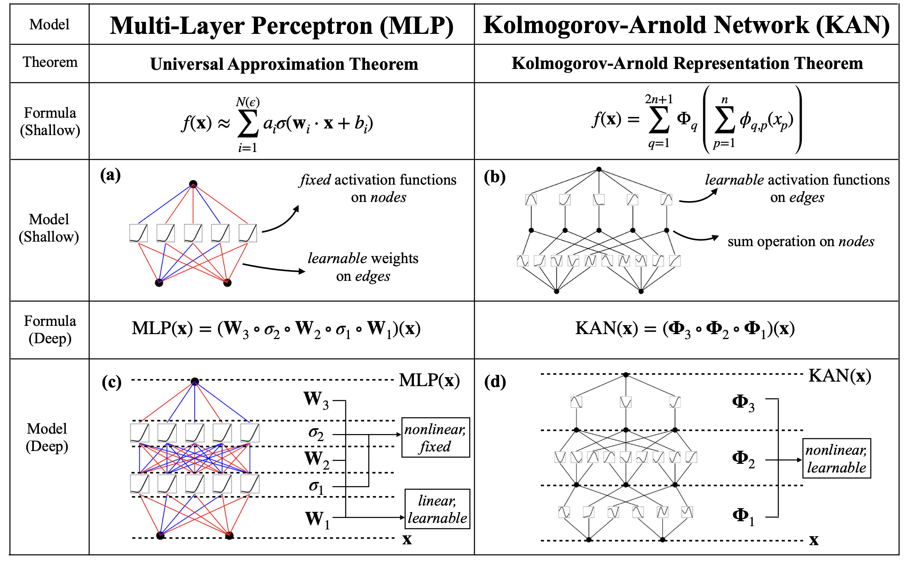
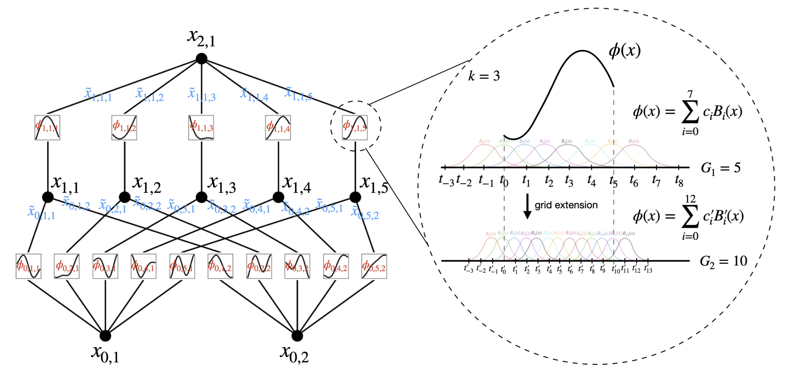

These are rough lecture notes for a paper review discussion held fall 2025 with the SMU data Applied Mathematics/Data Science Journal Club. This work is simply a partial account of the content in the Cited paper.

Author: Mason A. McCallum

## Citation
Ziming Lui, et al (2024). KAN:Kolmogorov-Arnold Networks. arXiv. https://arxiv.org/abs/2404.19756v4
Julius Berner, et al (2021). The Modern Mathematics of Deep Learning. https://arxiv.org/abs/2105.04026
## Paper Abstract
Inspired by the Kolmogorov-Arnold representation theorem, we propose Kolmogorov-Arnold Networks (KANs) as promising alternatives to Multi-Layer Perceptrons (MLPs). While MLPs have fixed activation functions on nodes ("neurons"), KANs have learnable activation functions on edges ("weights"). KANs have no linear weights at all -- every weight parameter is replaced by a univariate function parametrized as a spline. We show that this seemingly simple change makes KANs outperform MLPs in terms of accuracy and interpretability. For accuracy, much smaller KANs can achieve comparable or better accuracy than much larger MLPs in data fitting and PDE solving. Theoretically and empirically, KANs possess faster neural scaling laws than MLPs. For interpretability, KANs can be intuitively visualized and can easily interact with human users. Through two examples in mathematics and physics, KANs are shown to be useful collaborators helping scientists (re)discover mathematical and physical laws. In summary, KANs are promising alternatives for MLPs, opening opportunities for further improving today's deep learning models which rely heavily on MLPs.

## Kolmogorov-Arnold Representation Theorem 
Vladimir Arnold and Andrey Kolmogorov  
If f is a multivariate continuous function on a bounded domain. F can be written as a finite composition of continuous functions of one variable and the Binary operation of addition.  
For smooth $f:[0,1]^n \rightarrow \mathbb{R}$
$$
\begin{equation*}
  f(x)=f(x_1, x_2,...,x_n) = \sum_{q=1}^{2n+1}\Phi_q\left(\sum_{p=1}^n \phi_{q,p}(x_p)\right)
\end{equation*}
$$
where $\phi_{q,p}:[0,1]\rightarrow\mathbb{R}$ and $\Phi_q:\mathbb{R}\rightarrow\mathbb{R}$

## KAN notation
The shape of a KAN $[n_0, n_1,...,n_L]$. Where $n_i$ is the number of nodes in the $i^{th}$ layer. The $i^{th}$ neuron in the $\ell^{th}$ layer $(\ell, i)$ which has activation value $x_{\ell, i}$. Between Layel $\ell$ and $\ell+1$ there are $n_\ell n_{\ell+1}$ activation functions. Activation functions connecting $(\ell, i)$ and $(\ell+1, j)$ is $\phi_{\ell,j,i}$. $\tilde{x}_{\ell,j,i}=\phi_{\ell,j,i}(x_{\ell,i})$. $x_{\ell+1, j}=\sum_{i=1}^{n_\ell}\tilde{x}_{\ell, j, i}$

$$
\begin{equation*}
  x_{\ell+1}=\underbrace{\begin{pmatrix}
                &\phi_{\ell,1,1}(\cdot)\;\;\;\dots\;\;\;\phi_{\ell,1,n_{\ell}}(\cdot)\\
                &\vdots\;\;\;\;\;\;\;\;\;\ddots\;\;\;\;\;\;\;\;\;\vdots\\
                &\phi_{\ell,n_{\ell+1},1}(\cdot)\;\;\;\dots\;\;\;\phi_{\ell,n_{\ell+1},n_{\ell}}(\cdot)\\
             \end{pmatrix}}_{\Phi_\ell}x_\ell
\end{equation*}
$$

## Theorem 1.16 (Approximation theory MLP) [2]
Let $d,k\in\mathbb{N}$ and $p\in[1,\infty]$. Further let $\rho\in C^\infty(\mathbb{R})$ and assume that $\rho$ is not a polynomial. Then there exists a constant $C\in(0,\infty)$ with the following property: For every $n\in\mathbb{N}$ there exists parameters $\theta^{(1)}\in\mathbb{R}^{n\times d}\times\mathbb{n}$ for the first layer of the MLP architecture $a=((d,n,1),\rho)$ such that for every $g\in W^{k,p}((0,1)^d)$ it holds that
$$
\begin{equation*}
\inf_{\theta^{(2)}\in\mathbb{R}^{1\times n}\times\mathbb{R}} ||\Phi_a(\cdot,(\theta^{(1)},\theta^{(1)},))-g||_{L^p((0,1)^d)}\le cn^{-\frac{d}{k}}||g||_{W^{k,p}((0,1)^d)}
\end{equation*}
$$

## Theorem 2.1 (Approximation theory KAT)
Let $\bm{x}=(x_1,x_2,x_3,...,x_n)$. Suppose that a function $f(\bm{x})$ admits a representation
$$
\begin{equation*}
f = (\Phi_{L-1}\circ\Phi_{L-2}\circ\dots\circ\Phi_{1}\circ\Phi_{0})x
\end{equation*}
$$
where each one of the $\Phi_{\ell,i,j}$ are $(k+1)$-times continuously differentiable. Then there exists a constant C depending on f and its representation, such that we have the following approximation bound in terms of the grid size G: there exist k-th order B-spline functions $\Phi_{\ell,i,j}^G$ such that for any $0\le m\le k$ we have the bound
$$
\begin{equation*}
||f-(\Phi_{L-1}\circ\Phi_{L-2}\circ\dots\circ\Phi_{1}\circ\Phi_{0})||_{C^m}\le CG^{-k-1+m}
\end{equation*}
$$
where
$$
\begin{equation*}
||g||_{C^m} = \max_{|\beta|\le m}\sup_{x\in[0,1]^n}|D^\beta g(x)|
\end{equation*}
$$

## KART vs UAT

